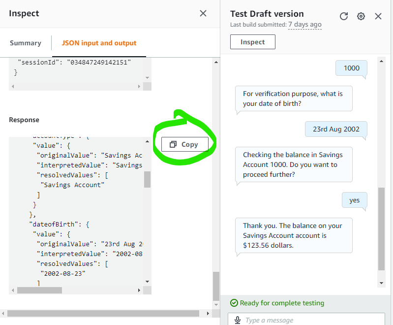
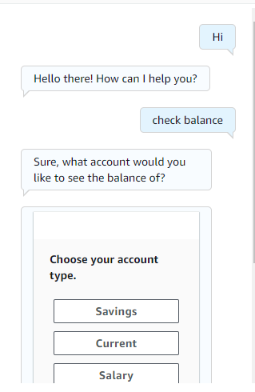
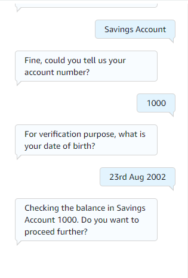
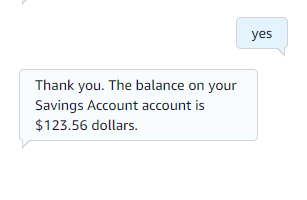
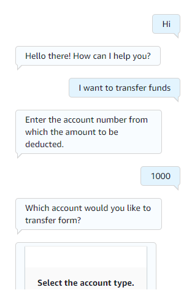
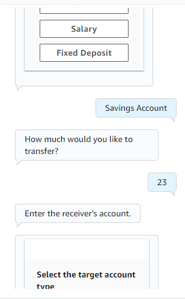
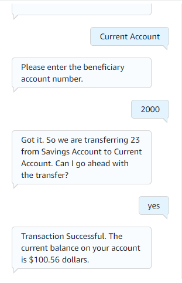

# myBankingBot

## This is a banking bot made with AWS Lex and Lambda Function having two intents namely check balance and transfer funds.


## ISome of the account details in our bank are displayed below.
```
{
    'Savings Account': {
        1000:{
            'bal':123.56,
            'dob':"2002-08-23"
        },
        1001:{
            'bal':54.15,
            "dob":'2001-05-04'
        },
        1002:{
            'bal':456.56,
            'dob':'1992-08-04'
        }
    },
    'Current Account': {
        2000:{
            'bal':411.0,
            'dob':"2001-08-23"
        },
        2001:{
            'bal':789.56,
            "dob":'2001-05-04'
        },
        2002:{
            'bal':456.56,
            'dob':'1992-08-04'
        }
    },
    'Fixed Deposit Account':{
        3000:{
            'bal':311.0,
            'dob':"2001-08-23"
        },
        3001:{
            'bal':789.56,
            "dob":'2001-05-04'
        },
        3002:{
            'bal':456.56,
            'dob':'1992-08-04'
        }
    },
    'Salary Account':{
        4000:{
            'bal':321.0,
            'dob':"2001-08-23"
        },
        4001:{
            'bal':789.56,
            "dob":'2001-05-04'
        },
        4002:{
            'bal':789,
            'dob':'1992-08-04'
        }
    }
    

}

```


# Writing a lambda function from scratch



1. Go to inspect and copy the request after the intent is fulfilled.
2. Copy the JSON code and observe it carefully.
3. The interpreted value in the JSON object gives us the input from the user viz, account number and date of birth in this context.
4. Apply required functionality in python and return the JSON object specified in the **myBankingHelper.py** code.


# CheckBalance Intent
<br>
<br>
<br>


# TransferFunds Intent
<br>
<br>
<br>


## You can cross verify the balance of the benificiary.


## Feel free to ping me up if you have any doubts here: cheboluvishnu@gmail.com